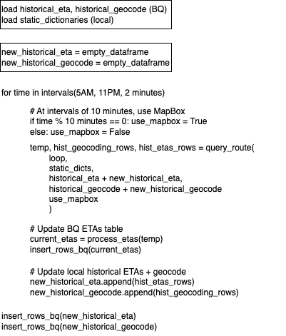

# jeep-tracking

## Notes
* <a href="https://docs.google.com/presentation/d/1HBI2O9_CNfGgkSPSBcUgp-rGfJwl4dMcvhflibpxaxk/edit?usp=sharing">Front-End Mockups</a>
* <a href="https://docs.google.com/document/d/1W9fd7fIbHWqNY2xjkL8QkQWF4GuLpQxDbfExf7RjfAw/edit?usp=sharing">Logistics + Business Ideas</a>

## Front End 
- [ ] Notif Sounds at 5, 3, 1, 0 Mark
- [ ] QR Code Link to Website (i.e. scan QR code, opens the website)
- [ ] Function to save time and ID queried by commuter to BQ table

## Back End
- [X] Automate querying with AirFlow
- [X] Get GPS working agh
- [ ] Get CloudFlare site hosted
- [ ] Figure out the ad integration

### Script to Update Table
To update the table, we run the `query.py` script; to do so, we run
```
python query.py --route_name aurora_loop --use_mapbox True
```



## Feature Wishlist
- [ ] Android App
  - [ ] Let users save favorite stops
  - [ ] App badge notifs
- [ ] Ask users to verify when they got on, for us to improve predictions
- [ ] Figure out how to get users’ locations, to figure out if they’ve ridden the jeep – goal is to tell the stats
- [ ] Figure out what other companies do with commuting info, there must be a way that they leverage this which is important given that we don’t have good data for this back home

## Set-Up
### Environment
```
conda create -n jeep_tracking python=3.9
pip install -r requirements.txt
```

### AirFlow 
Setting Up AirFlow
```
export AIRFLOW_HOME=~/airflow
airflow db init

airflow users create \
    --username admin \
    --firstname Lorenzo \
    --lastname Flores \
    --role Admin \
    --email jeep.tracking.app@gmail.com
```

Open AirFlow Web Interface
```
airflow webserver --port 8080
airflow scheduler
```

### Google Cloud API
Goal: Be able to use JS/Python to query the tables we have stored in BQ

#### Python
* Step 1: Install the Google Cloud CLI following steps 1-4 here: https://cloud.google.com/sdk/docs/install
* Step 2: Log in and create a credential file using `./google-cloud-sdk/bin/gcloud auth application-default login` (This will lead you to sign-in online into the GMail account, sign in with AsanKa, or personal emails)
* Step 3: Set the project name using `./google-cloud-sdk/bin/gcloud config set project eco-folder-402813`
* Step 4: Pray

This is how we then query a table:
```
import pandas as pd

from google.cloud import bigquery
from utils import query_latest_etas

# Specify the project folder to establish a client
client = bigquery.Client(project="eco-folder-402813")

# Run the query to get the latest ETAs per stop
output = query_latest_etas(client)

# Display the output as a DataFrame
pd.DataFrame.from_dict([dict(item) for item in output])
```

#### JavaScript
First, in the terminal, upgrade the version of Javascript
```
sudo npm cache clean -f 
sudo npm install -g n install n 
sudo n stable
```

Then, install the Google Cloud BigQuery package
```
npm install @google-cloud/bigquery
```

Finally, run the query.js script

## CloudFlare Workers Notes
```
# To query the BigQuery JSON
fetch('https://jeep-tracking-worker.ljyflores.workers.dev/query').then(res => res.json())
```